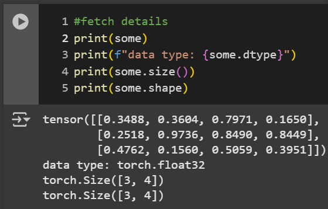
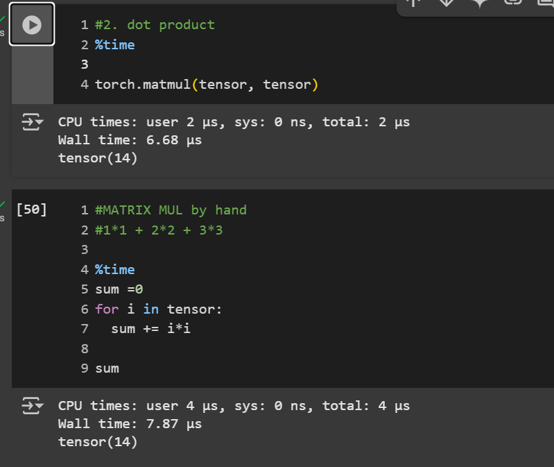
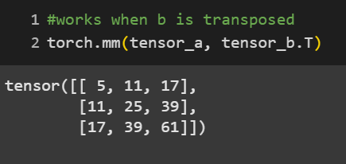
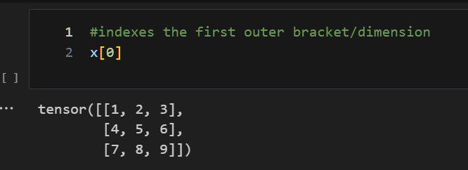
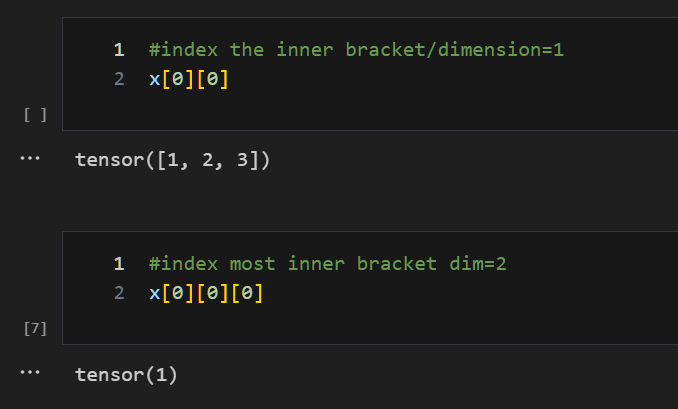
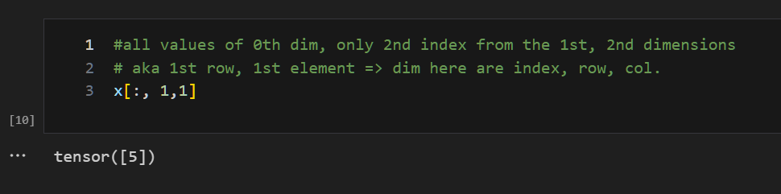

# 2-4

## Tensor's info fetching

### tensor's shape vs size:
  - shape => attribute/property
  - size(): a whole function
-- yet: give exactly the same output.

### to change the device:
- torch.device('mps')
- torch.device('mps', 0) -- type, index
- torch.device('mps: 0');  r.device  -- r = tensor
- torch.randn((2,3), device=cuda1)
- tensor = tensor.to('device') --> tested one
  - Tensors are never moved automatically between devices and require an explicit call from the user.
  

### Operations on tensors:
- all the operations are made implicitly, no need to apply it one by one on each element
- tensor [*-+/] scalar
  - if no assignment is made, the original tensor is still  as is no changes to the original tensor, just a copy applied upon the operation.
- there's built-in functions as well, yet not as readable as direct operators.
  
- MATRIX MUL:
  - just a dot product 
  1. element wise => each position * same position = matrix
  2. dot product => row * column [one of em is vectorized to get T^-1], multiplied then summed. -matmul()-

- using functions is waaay faster than implementing it by hand or even loop thropugh them

### most popular error => tensor ain't in right shape
- get its transpose.
- transpose -> switches axes or dimensions of a given tensor
- 

### aggregation
- in the mean => needs to be float, as it's wrong in the data type => one of the most common errors in the tensor
- can cast the data type using: tensor.type(torch."datatype")

### Positional Aggregations:
- argmin(), argmax()
- returns index of min,max

### reshaping, stacking, squeezing
- stack: hstack, vstack => horizontally or vertically stacking dimensions?
  - masked tensors, stack, cat => [statquest](https://youtu.be/L35fFDpwIM4?si=hVTPm-s21F4M5l_3)

- reshaping: extra dim => gotta be compatible with original size
  - (2,9) => 18 elements, 9/dim
  - (9,1) => 1 element, 9 dim 

- squeezing: rmv all 1 dim
  - #shape=[9,1] .squeeze => shape[9] => removes all 1 dimensions!
- unsqueeze: adds 1 dim, whether to the 1st index, 2nd, n => [9,1],,[10]
  - #dim=0 aka adding the extra dimension to the zeroth index of the size/tensor or adding new dimension in new index => dim=1

- permute: rearrange dim of target tensor in specified order
  - return view(shares original memo) => view that changes the SIZE DIM themselves
  - same data, different POV, share same memory even though diff shapes

  
- Indexing:
  - x[0] => inner tensor
  - x[0][0] => zeroth index of tensor
  - x[0][0][0] => first/zeroth element in the index
  - 
  - 
  - 
