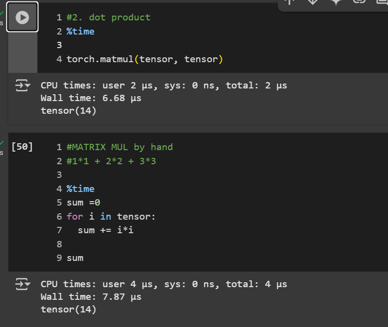
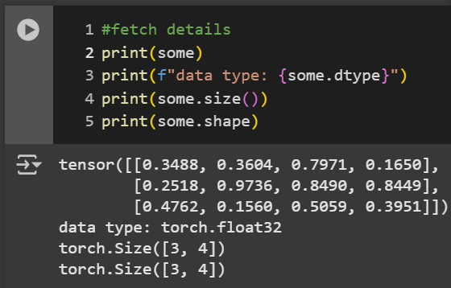

# 2-4

## Tensor's info fetching

### tensor's shape vs size:
  - shape => attribute/property
  - size(): a whole function
-- yet: give exactly the same output.

### to change the device:
- torch.device('mps')
- torch.device('mps', 0) -- type, index
- torch.device('mps: 0');  r.device  -- r = tensor
- torch.randn((2,3), device=cuda1)
- tensor = tensor.to('device') --> tested one
  - Tensors are never moved automatically between devices and require an explicit call from the user.
  

### Operations on tensors:
- all the operations are made implicitly, no need to apply it one by one on each element
- tensor [*-+/] scalar
  - if no assignment is made, the original tensor is still  as is no changes to the original tensor, just a copy applied upon the operation.
- there's built-in functions as well, yet not as readable as direct operators.
  
- MATRIX MUL:
  - just a dot product 
  1. element wise => each position * same position = matrix
  2. dot product => row * column [one of em is vectorized to get T^-1], multiplied then summed. -matmul()-

- using functions is waaay faster than implementing it by hand or even loop thropugh them

### most popular error => tensor ain't in right shape
- get its transpose.
- transpose -> switches axes or dimensions of a given tensor
- 

### aggregation
- 

