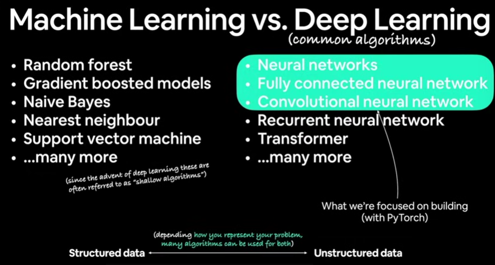
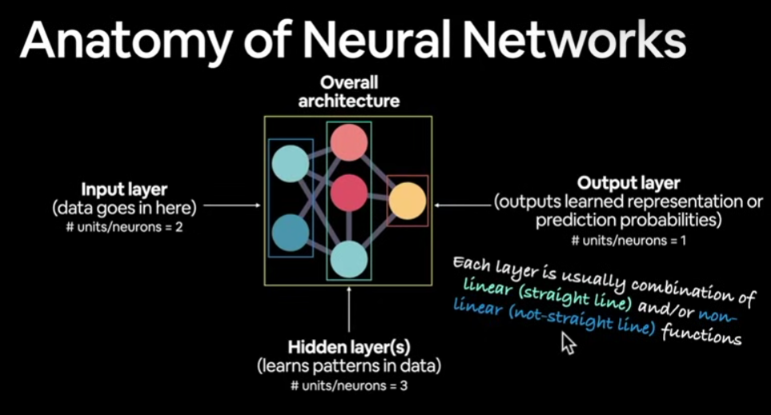
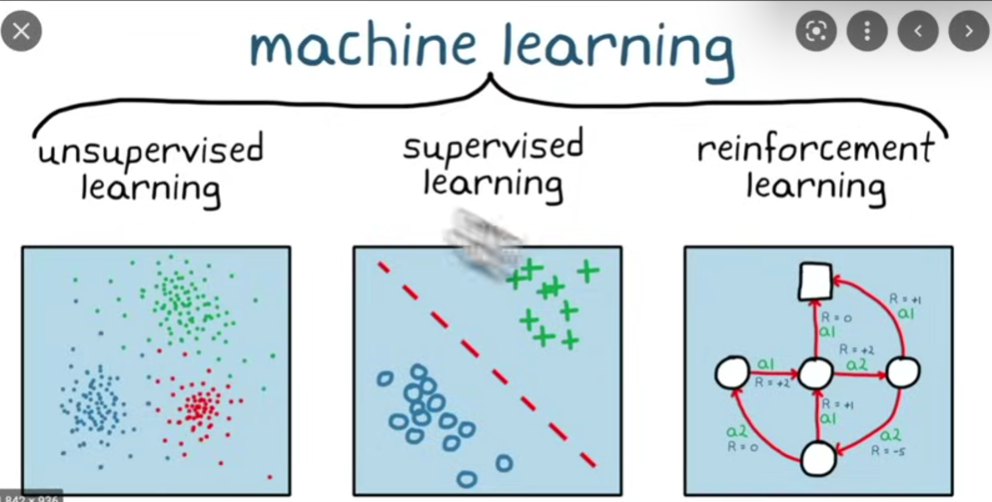
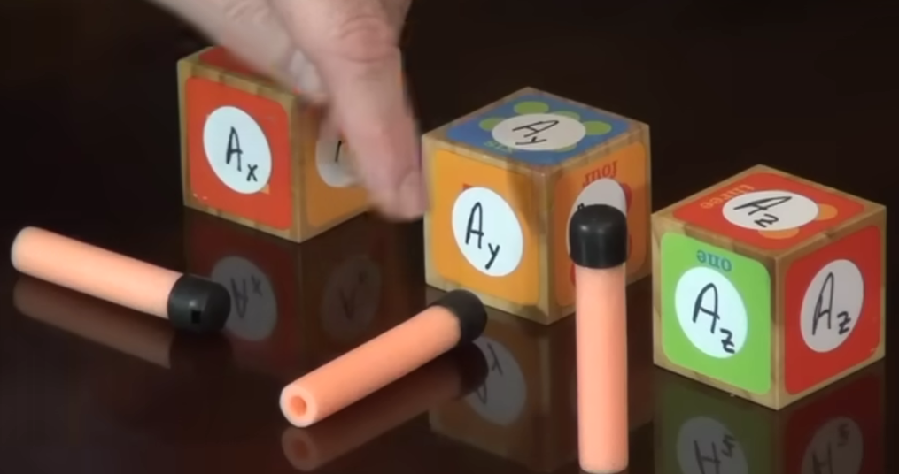
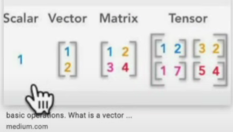
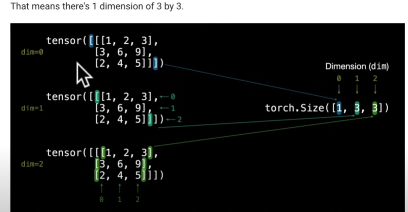

# Funds?

## 1. Traditional vs ML

### 1.1 Traditional: input + rules = output

- Explainability  
- Traditional approach better (simpler)  
- Unaccepting of errors  
- Not enough data to extract rules  

### 1.2 ML || DL: input + output = rules

- Good for the things that have millions of rules you can't throw out of your mind  
- Environment change  
- Large data extracting insights (e.g., differentiating 100 kinds of food, each with its own rules)  

## 2. ML vs DL

### 2.1 ML

- Structured data: rows and columns  
- Production systems  
- Example: XGBoost  

### 2.2 DL

- Unstructured data: posts, wikis, images, audio files  
- Example: neural networks  
- Usages?  

## 3. Neural Networks

- Input: unstructured data  
- Turn it into numbers (numerical encoding)  
- Pass it to NN -> learns representation (weights)  
- Representation outputs (features, classes)  
- Outputs: human understandable form  

## 4. Types of Learning

- Supervised: data + labels for each  
- Unsupervised: inherit representations / figure out differences without labeling  
- Transfer: take patterns learned and transfer to another model to get a head start  
- Reinforcement learning: environment + agent => rewards/no reward  

# PyTorch

## 1. GPU/TPU?

### 1.1 CUDA

- Run ML code on GPU  

### 1.2 TPU: Tensor Processing Unit (not as popular)

#### 1.2.1 Tensor?

![Tensor]

- Any numerical representation mainly  
- [Dan's Explanation](https://youtu.be/f5liqUk0ZTw?si=ERNNCMsPsRMAYRY6)  
  - Vectors: can represent an area, make its length proportional to square meters of area + perpendicular on it  
  - V-components: projection of vector on the axis, so instead of drawing the vector, we can say it's *n* of X units, *m* of Y units, etc., in column vector  
  - 
  - Vectors are rank 1 tensors -> a basis vector for each direction, one directional component for each axis  
  - Scalars -> tensors of rank zero, no direction needed  
  - Forces + areas vectors per surface => rank 2 tensor (2×2 matrix)  
  - 3D matter representations -> (3×3 matrix) -> 3 indices for each component -> rank 3 tensor  
  - Lillian Libres  

## 2. Workflow

![Workflow]

## 3. Intro to Tensors

- ==as1: read torch.tensor from doc==  
- ![Intro to Tensors] 
- Anytime encoding data into numbers => `torch.tensor`  
- We use numerical brackets `[]` in tensors => depending on level of nesting  
  - 2D => `[]`  
  - 3D => `[[]]`  
  - 4D => `[[[]]]`, etc.  

- Tensors = batches of matrices  
- Here, 1 matrix, 3 rows, 3 columns => (1, 3, 3) => tensor's shape  
- So outer `[]` => contains batches, inner `[]` contains matrix/matrices, then `[]` contains each vector/element  
- `'tensor['batch'['matrix[vector[]]]]' => (1b, 1m,1v(r,c))`  
- Why MATRIX, TENSOR => all caps? No idea.  

- ==as2: read random.tensors from doc==  
- as3: `torch.arange`  
- `tensor_like` => same shape of some tensor  
  - `tensor1 = torch.zeros_like(tensor2)`  
  - Making a tensor - tensor1 - with the shape of tensor2 but filled with zeros instead of elements, just got the structure only  

## 4. Data Types

- ==as4: datatype read from doc==  
- Precision in computing: number of digits used to represent a number  
- Single float point => 32-bit, 16 => half precision => less memory => faster calculation  
